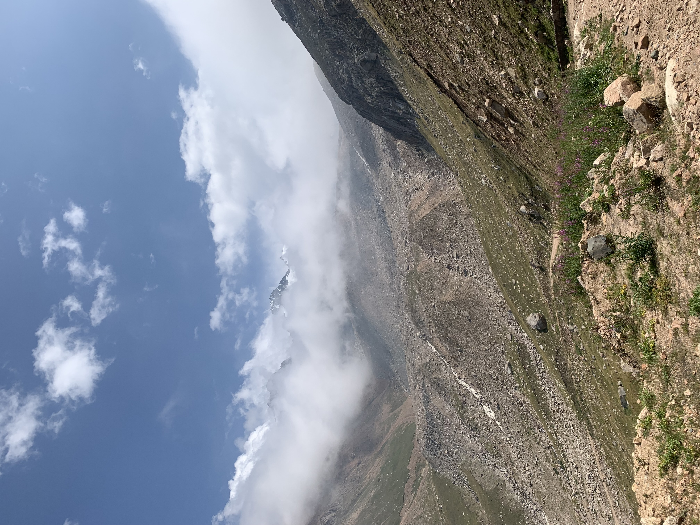

# About me

I'm Aigerim, a second year MSPPM student. My pronouns are she/her. I'm from Almaty, Kazakhstan. In my free time I like hiking. 
This is a picture from a recent hike in Almaty mountains.

# What I hope to learn 

#### * to organize data 
#### * to see most important patterns, trends in the data that's worth presenting
#### * to use visualizations effectively in my narrative

# Portfolio

This is a portfolio of works completed for the Telling Stories with Data course
[link](/debt.md)

### Assignment - Visualizing Government Debt
#### * [Government debt by country](/debt.md)

### Assignment
#### * [Critique by Design](/aipub.md)

### Final project
