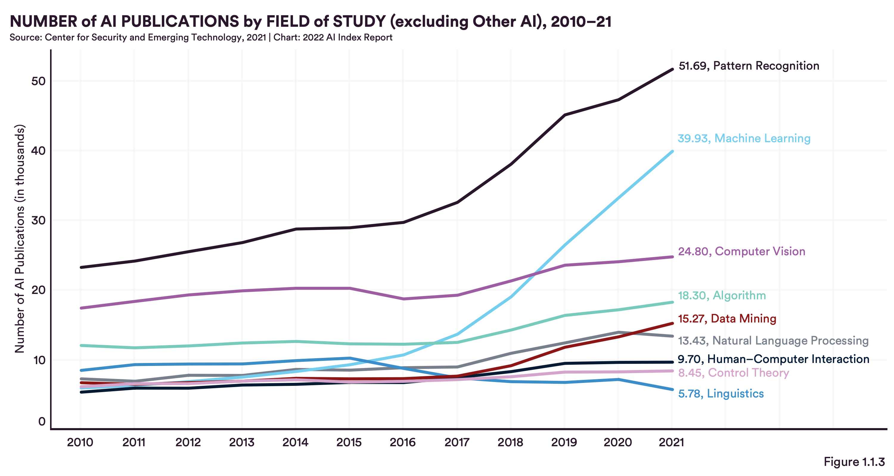
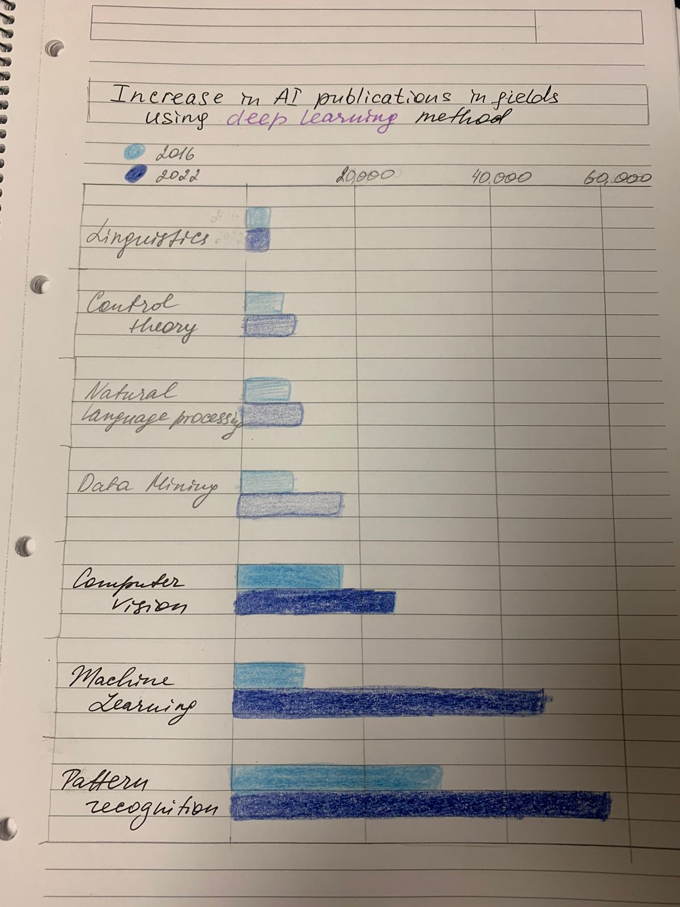

## Critique by Design 

For this assginment I chose this graph from the AI Index Report developed by Human-Centered Artificial Intelligence institute at Stanford University. This graph is found in chapter 1 on research and development. 

Report authors provide access to a public google drive with all data used to make graphs. 

https://aiindex.stanford.edu/wp-content/uploads/2022/03/2022-AI-Index-Report_Master.pdf 
https://docs.google.com/spreadsheets/d/1D_7XVaE4BK0DrEFRg0aLaQSYdGQ4YugA1OD3UPd4LMY/edit#gid=1815239521 

[Back](/https://aiindex.stanford.edu/wp-content/uploads/2022/03/2022-AI-Index-Report_Master.pdf)

### Step 1: Crtiquing 

core audience of the report are policymakers. so it's crucial to make it so clear that policymakers don't need a degree in CS to understand them. 

This is a good graph. It doesn’t score too low on any of the metrics. The reader can immediately see the dramatic growth of pattern recognition and machine learning publications in the recent years. The colors are not too bright. There’s hierarchy of font sizes. The title describes the graph well. 

However, I think that this graph can be changed to serve its target audience better. The main problem of this visualization and other graphs in this report is the mismatch between the audience background knowledge on the topic and the chart. The chart looks like it was made for researchers who can draw meaningful conclusions about the difference in publications between computer vision and control theory, for example. 

I think the title should be different. Because in the written part, authors mention how it is the deep learning method of AI that’s changing and affecting the field, and that’s why topics related to deep learning are experiencing such growth: machine learning, computer vision, and pattern recognition in particular. 

I would change the colors of the lines to highlight only the ones relevant for interpretation. Probably even making all other lines grey and 3-4 lines distinct colors. I would add a couple of vertical lines to mark the dates when certain AI milestones were achieved. 

Authors in the introduction state that the mission of the report is "to provide data for policymakers, executives, journalists, and the general public to develop a more thorough understanding of the field of AI". And it’s most likely that policymakers, journalists and the general public don’t know much about publications in the different sectors of AI field. The intention that emerges from reading the report is that AI is developing more rapidly than the laws and policies that should protect people. And the visualization should show this and give urgency to the problem of safe AI development. 
Instead, this visualization shows us the rise in AI publications since about 2016 and not much else. So I would say it's not effective at reaching its audience. Because the audience needs a more clear explanation of what to focus on, which lines among all of them are more important, what does it mean that there's a rise in publications, why should they care. There is accurate information presented but I think it needs more focus. 

### Sketching 

### Testing

I talked to 5 people in total. I got great feedback from all of them. 

At first I talked to my mother. And since she's not familiar with the AI topic, I thought if she understands the graph, that would mean the graph is working. However, I also wanted people to get the right kind of conclusion. 

*Professor, 60s* 
  * *Linguistics isn't doing well.*
  * *The graph is very simple.*
  * *Machine learning and pattern recognition are doing very well.* 

So I asked my roommate for feedback and that's what I got: 

*Student, 30s*
  * *Maybe change colors, two blues are confusing.*
  * *What is control theory?*
  * *I think even a high school student can uderstand this.*
  * *Machine learning is blowing up but I knew that already.* 

Here I got another confirmation that the chart is easy to read. I started thinking if I should change the colors. And I understood that not all readers are going to understand each row name, such as 'control theory'. Even if I can't explain what it is, I wanted for readers to know at least that it's a subfield of AI. And hopefully people reading this report would already know what AI is. So maybe I could change the title to explain that all bars are fields of AI. 

A third person I talked to was my friend from Heinz. These are the insights from my conversation with her: 

*Student, 20s* 
  * *At first attention is drawn to liguistics.* 
  * *I like the color pallete.*
  * *Add more numbers on the x-axis.*

In this conversation, I remembered that the first person I talked to also saw linguistics first. And based on that I decided to change the sorting of bars to show the most relevant and biggest values first. This seems like an obvious thing to do but it didn't occur to me when I was doing the sketch. 
In contrast with the second respondent, she liked the colors. So I haven't decided to change them yet. And it was clear that I should add gridlines and have more values there. I think when you look at the data for a long time, you learn it so well that you forget that readers need more information regarding numbers. 

Finally, I got feedback from two of my fellow students in class. Both of them said the chart was clear and they liked the colors too. That's why I decided to keep lighter blue for 2016 and darker blue for 2021. This is other feedback that I found helpful: 

*Student, 20s*
  * *I assumed based on the title that all fields listed here use deep learning.* 
  * *What is the x-axis? The number of publications?* 
  * *You should add an asterisk to fields using deep learning or find another way to distinguish them.*

*Student, 20s*
  * *Why is deep learning in purple?* 
  * *I can't read your handwriting.* 
  * *The legend for years is clear.*

It's interesting that none of the people I surveyed noted that I highlighted last three bars in darker colors to show that these were the fields using deep learning. From this I concluded that it's ineffective. This is why I decided to add abbreviation "DL" to the relevant bars.
Also, when I changed the original title, I got rid of the words 'number of publications' and didn't add them in the legend of on the x-axis. 

### Building

 

##### [Back to portfolio](/README.md)
